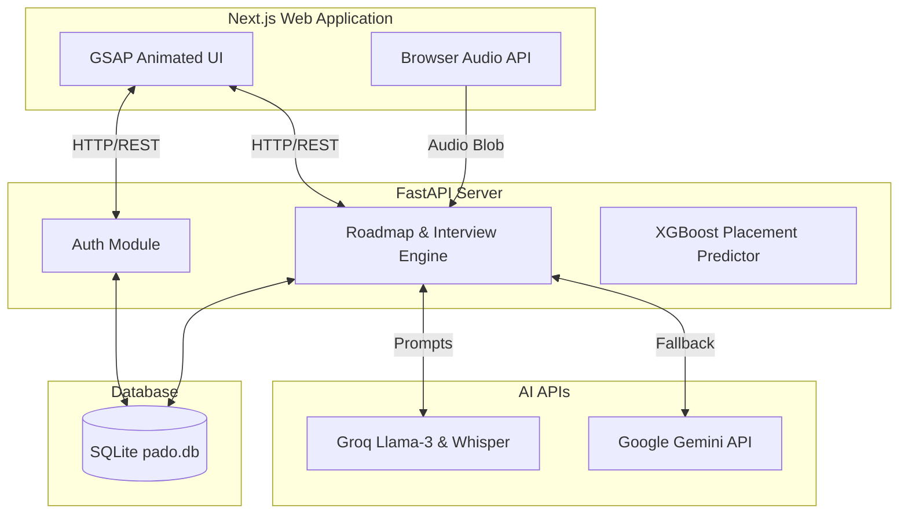
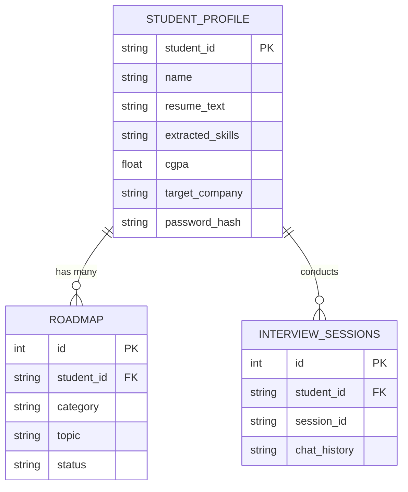

# Software Requirements Specification (SRS) - Lite

## 1. Project Overview
* **Project Name**: PADO
* **Team Name**: [Your Team Name]
* **Problem Statement**: College students often lack personalized, structured guidance and realistic mock interview environments to prepare effectively for technical and behavioral placement interviews.
* **One-line Solution**: An AI-powered placement coach that analyzes resumes, generates tailored study roadmaps, and conducts interactive mock interviews to guarantee placement readiness.
* **Elevator Pitch (2–3 lines)**: PADO bridges the gap between academic learning and industry expectations. By leveraging AI to provide a customized roadmap and real-time interview feedback based on a student's resume and target company, PADO acts as a 24/7 personal placement mentor.

## 2. Problem Understanding
* **What problem are you solving?** Students struggle to identify skill gaps on their resumes and lack access to immediate, realistic interview practice before facing actual recruiters.
* **Why does it matter?** A significant percentage of capable candidates are rejected due to poor interview preparation or a lack of understanding of specific company requirements, leading to missed career opportunities.
* **Who experiences this problem?** Final and pre-final year university students preparing for campus placements, as well as recent graduates seeking entry-level software engineering roles.

## 3. Target Users / Personas

**Student**
* **Role**: Job Seeker
* **Goals**: Wants to land a software engineering role at top-tier companies; needs to know exactly what to study.
* **Pain Points**: Overwhelmed by the vast amount of topics to cover; doesn't know if their resume matches ATS requirements; gets nervous during live interviews.

**University Placement Coordinator** (Secondary)
* **Role**: Administrator
* **Goals**: Ensure maximum placement percentage for the university.
* **Pain Points**: Cannot manually track or personally mentor hundreds of students simultaneously.

## 4. User Stories
1. As a student, I want to upload my resume text so the system can extract my existing skills.
2. As a student, I want to enter my target company so the AI can tailor my preparation journey.
3. As a student, I want to view an AI-generated study roadmap so I know exactly what technical and behavioral topics to master.
4. As a student, I want to take dynamic mock interviews so I can practice answering questions under pressure.
5. As a student, I want to use voice recording to answer interview questions so the experience feels like a real conversation.
6. As a student, I want to receive immediate feedback and scoring on my interview answers so I can identify weak points.
7. As a user, I want the UI to be highly responsive and modern so I remain engaged during my preparation.

## 5. Functional Requirements
* **Authentication**: The system shall allow users to register and log in using a Student ID and Password.
* **Resume Processing**: The AI shall extract technical skills and proficiencies from user-provided resume text.
* **Roadmap Generation**: The system shall generate a structured roadmap (DSA, Core Subjects, Communication) tailored to the student's skills and target company.
* **Mock Interviews**: The system shall dynamically generate follow-up interview questions based on previous answers and the user's roadmap.
* **Audio Processing**: The system shall process audio recordings using Groq's Whisper API to transcribe spoken answers into text.
* **Analytics**: The system shall display performance scores (e.g., Technical Accuracy, Communication, Confidence) based on interview responses.

## 6. Non-Functional Requirements
* **Performance**: API response times for database queries shall be < 1 second. LLM responses shall stream or return in < 5 seconds.
* **Availability**: The system must run flawlessly in a local environment for demo purposes without external DB dependencies.
* **Security**: API keys (Groq, Gemini) must be loaded securely via `.env` files and never exposed to the frontend. Password hashes must be utilized.
* **Usability**: The application shall feature a responsive, "premium-feeling" UI with GSAP micro-animations and dark mode aesthetics.
* **Resilience**: The backend must include a fallback to Google Gemini if the primary Groq LLM API fails or times out.

## 7. Product Backlog
**Must**
* User registration and authentication.
* Resume skill extraction via LLM.
* Study roadmap generation based on target company.
* Text-based adaptive mock interviews.
* Audio answer transcription (Whisper).

**Should**
* Analytics dashboard displaying scores over time.
* Machine Learning (XGBoost) model integration to predict placement probability based on datasets.

**Could**
* Social/Leaderboard feature for students in the same university.
* PDF Resume parsing instead of text pasting.

**Won't**
* Video analysis of user expressions (out of scope for this hackathon).

## 8. Technology Stack
* **Frontend**: Next.js, React, Tailwind CSS, GSAP. 
  * *Justification*: Next.js provides rapid routing; Tailwind & GSAP ensure a highly premium, modern, and animated UI required to wow the jury.
* **Backend**: FastAPI (Python). 
  * *Justification*: Exceptionally fast for async operations and natively supports Python's robust AI/ML libraries (Librosa, Scikit-learn, XGBoost).
* **Database**: SQLite. 
  * *Justification*: Lightweight and embedded; requires zero configuration to run locally during high-pressure hackathon demos.
* **AI & LLM**: Groq (Llama 3, Whisper) & Google Gemini API. 
  * *Justification*: Groq provides industry-leading inference speeds (essential for real-time interviews), with Gemini acting as a reliable fallback.

## 9. High-Level Architecture

## 10. Database Design

**Main Entities & Relationships**
* **Student Profile**: Primary user table.
* **Roadmap**: Items to study, linked to the student.
* **Interview Sessions**: Records of mock interview attempts.

## 11. API Design
| Method | Endpoint | Purpose |
|--------|----------|---------|
| POST | `/student/register` | Register user, parse resume, and generate initial roadmap |
| POST | `/student/login` | Authenticate user |
| GET | `/student/{student_id}/roadmap` | Fetch the generated study roadmap |
| POST | `/agent/interview/start` | Initialize a new mock interview session |
| POST | `/agent/interview/answer` | Submit an answer and get the AI's feedback/next question |
| POST | `/audio/transcribe` | Convert voice recordings to text using Groq Whisper |

## 12. Sprint Plan (Hackathon Execution)
| Task | Priority |
|------|----------|
| **UI Design & Animations (GSAP/Tailwind)** | High |
| **Backend Architecture & DB Setup (SQLite/FastAPI)** | High |
| **LLM Prompts & API Integration (Groq/Gemini)** | High |
| **Audio Transcription Engine** | Medium |
| **ML Model Preloading & Dataset Caching** | Medium |
| **Final Bug Fixes & Presentation Prep** | High |

## 13. Engineering Tenets
1. **Speed over Perfection**: Focus on functional end-to-end flows for the demo rather than edge-case completeness.
2. **User Experience over Technical Elegance**: The visual presentation and interface responsiveness must instantly impress the jury.
3. **Resilience and Fallbacks**: Always have a backup plan (e.g., Gemini fallback if Groq rate limits, strict UTF-8 enforcement to prevent Windows crashes).
4. **Simplicity over Complexity**: Use SQLite over PostgreSQL to eliminate deployment blockers and configuration errors.
5. **Demonstrability**: The application must work flawlessly on `127.0.0.1:8000` locally without external deployment bottlenecks.

## 14. Test Cases
| Feature | Test | Type |
|---------|------|------|
| Registration | Valid credentials and resume text | Happy Path |
| Registration | Attempt to register with existing ID | Negative |
| Login | Invalid password | Negative |
| Roadmap | Missing `target_company` input | Edge Case |
| Audio | User submits empty/corrupted audio blob | Negative |
| AI API | Groq API key missing or rate-limited | Edge Case (Verifies Gemini fallback) |
| Backend | Print non-ASCII emoji on Windows CP1252 console | Edge Case (Verifies UTF-8 encoding fix) |

## 15. Risks & Assumptions

**Risks**
* AI API quota exhausted during the live demo.
* Slow internet connection causing latency in audio transcription.
* Microphone permission issues on presentation devices.

**Assumptions**
* Judges will test the application on modern browsers (Chrome/Edge).
* An active internet connection is available to reach HuggingFace and Groq endpoints.
* The system is run strictly on `127.0.0.1` to bypass Node DNS IPv6 resolution delays.

## 16. Future Scope
* **Automated PDF Parsing**: Directly upload PDF resumes instead of copy-pasting text.
* **Video Interviews**: Use WebRTC and computer vision to analyze body language, eye contact, and confidence during mock interviews.
* **Recruiter Dashboard**: Allow university placement cells to view aggregated metrics and shortlist top-performing students.
* **Real-time Leaderboards**: Gamify the experience by introducing university-wide rankings.
